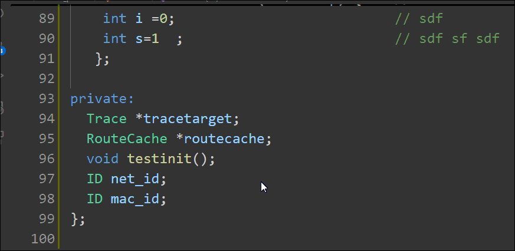
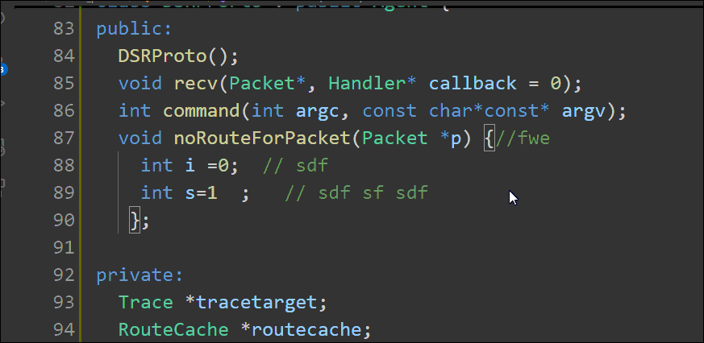

# vscode-forcecomment README

This is the README for the extension "vscode-forcecomment". It can help you to comment from time to time.

## Usage

### Auto prompt

### Align comment

Command : `Align`

Keyboard shortcut : `ctrl + shift + /`

## Known Issues

- no one has used it

## Release Notes

### v0.0.2

* add blame message to prompt the user for comment
 
### v0.0.1

- Add a simple tail-comment alignment functionality

***

## Changes
[Change Log](./CHANGELOG.md)

## License
[BSD 3-Clause License](./LICENSE)

## Unofficial Author's Words
> This is the tool I wanted but could not find so wrote myself.
> 
> I hope you will enjoy it!