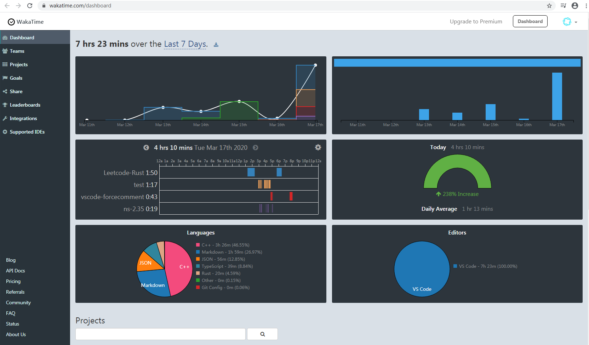

# 需求调研文档

## 程序员最讨厌的四件事

1. 写文档
2. 写注释
3. 不写文档
4. 不写注释

鉴于本人写代码没有养成写注释的习惯，看自己一个月前写的代码就已经看不懂了，愤而逼迫自己一定要养成不写注释就不写代码的好习惯，计划在自己使用的编辑器vscode上开发一款强迫用户写代码时不时写注释的插件。

## 现有解决方案调研

### WakaTime

下面是[WakaTime官方About页](https://wakatime.com/about)的一段翻译

> WakaTime致力于为每个程序员提供全自动的时间跟踪。 通过为IDE和文本编辑器创建开源插件，我们可以提供有关如何编码的强大见解，并让您回到最重要的方面：创建出色的软件。

用了Wakatime之后你[可以](https://zhuanlan.zhihu.com/p/20556571)：
- 分析自己的编码时间，看看时间都去哪了，方便自己以后更加高效的分配时间
- 统计自己平时代码中不同的语言占比
- 截图(zhuang)发给朋友看(bi)

但是在各个搜索引擎搜索后没有发现我所期望的能够帮助程序员养成写注释的好习惯的插件。